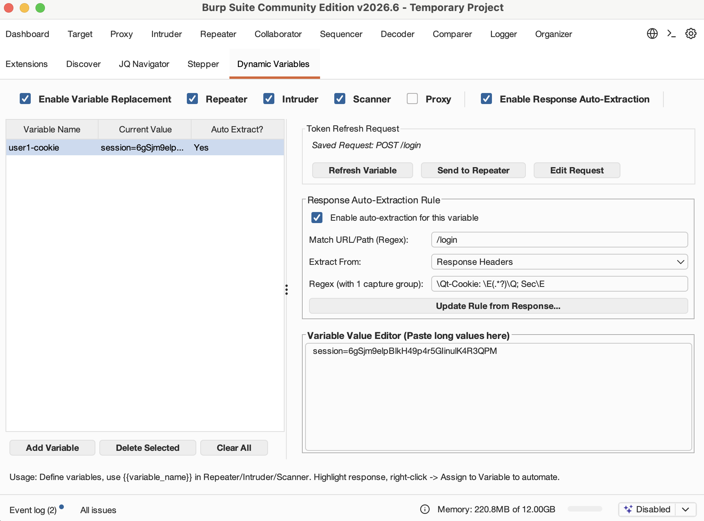
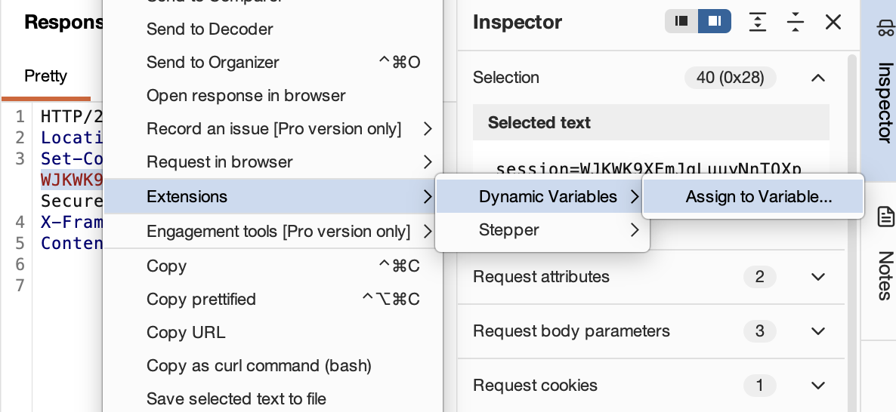
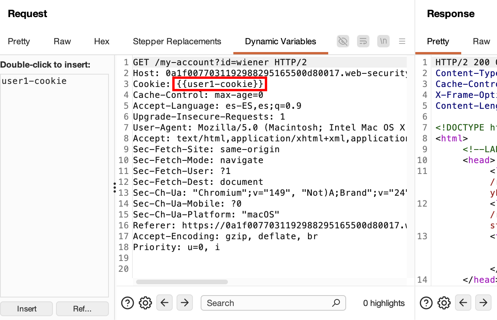

# Dynamic Variables — Burp Suite Extension

> **Placeholder-based request variables for Repeater, Intruder, Scanner and Proxy with transparent auto-refreshing on session expiration (401/403) in Burp Suite.**

Dynamic Variables is a Burp Suite extension that brings template variables and automatic session refreshes to your pentesting workflow. Define placeholders like `{{token}}` in Repeater, Intruder, Scanner, or Proxy requests (similar to how it is done in Postman), select text in HTTP responses to auto-generate regex extraction rules, and repeat login/refresh requests automatically in the background when your session expires.

---

## Index

- [Features](#features)
- [Screenshots](#screenshots)
- [How to Use](#how-to-use)
- [Use Cases for Pentesters](#use-cases-for-pentesters)
- [Installation](#installation)
- [Dependencies](#dependencies)
- [License](#license)

---

## Features

| # | Feature | Description |
|---|---------|-------------|
| 1 | **Placeholder Substitution** | Scans outgoing requests in **Repeater**, **Intruder**, **Scanner**, and **Proxy** for `{{variable_name}}` templates and replaces them with their actual values in real-time. |
| 2 | **Regex Auto-Deduction** | Highlight any token (JWT, cookie, JWE, anti-CSRF) in a response, right-click, and select *Assign to Variable...*. The scanner auto-generates the matching regex for JSON keys, query params, or XML tags. |
| 3 | **Variables Dashboard** | A centralized tab in Burp Suite to manage variable values, auto-extraction rules, and background request execution. Includes independent toggles to enable/disable substitution in Repeater, Intruder, Scanner, and Proxy. |
| 4 | **Request Auto-Refreshing** | Saves the request template that generated your token (e.g., login or auth endpoint). Re-sends it instantly in a background thread from the tab to fetch a fresh token. |
| 5 | **Recursive Injection** | If your saved refresh request itself depends on other variables (like credentials or client keys), they are substituted automatically before launching the request. |
| 6 | **Transparent Session Recovery** | When a request containing variables receives an HTTP `401 Unauthorized` or `403 Forbidden` response, the extension automatically pauses the transaction, executes the refresh request, updates the variable, and re-sends the original request with the fresh token. |
| 7 | **Interactive Rule Editor** | Click *Update Rule from Response...* to run the saved request and highlight the new token value directly in a raw HTTP response editor to auto-update the regex rule. |
| 8 | **Repeater Integration** | Send your saved login/refresh requests directly to the Repeater tab for manual tweaking and testing. |
| 9 | **Request Editor Sub-Tab** | Adds a custom request editor tab next to Raw/Hex to display a sidebar listing all defined variables. Double-click any variable to insert its `{{placeholder}}` at the cursor position. |
| 10 | **Zero Dependencies** | Built using the native Montoya API. No external libraries, 100% self-contained JAR. |
| 11 | **Variable Folders** | Organize variables by user, session, or context. Folder variables use qualified placeholders such as `{{alice.token}}`, allowing `alice.token` and `bob.token` to coexist safely. |
| 12 | **Request Folder Switching** | Replace every matching placeholder from one folder with its counterpart in another folder directly from a request's context menu. |

---

## Screenshots

| Dynamic Variables Tab |
|:---:|
|  |

| Assign to Variable (Context Menu) | Variable usage in request |
|:---:|:---:|
|  |  |

---

## How to Use

### 1. Define a Variable Manually
1. Open the **Variables** tab in Burp Suite.
2. Optionally click **New Folder** and create a folder such as `alice`.
3. Select the folder and click **New Variable**, or create the variable in **Ungrouped**.
4. Enter a name (e.g., `api_key` or `token`). Folder and variable names cannot contain `.`.
5. Select the variable in the table, and paste the value in the **Variable Value Editor** on the right.
6. In Repeater, reference an ungrouped variable as `{{api_key}}` or a grouped variable as `{{alice.token}}`. It will be substituted when the request is sent.

Folders can be expanded or collapsed. Drag variables to reorder them or move them between folders; because moving changes the placeholder, the extension shows the old and new placeholders before applying the move. Right-click a variable to rename it, copy its placeholder, move it, or delete it.

### 2. Auto-Extract Variables from Responses
1. Send a request that returns a token in the response (e.g., login request).
2. Go to the **Response** viewer tab.
3. Highlight the token value inside the response body or headers.
4. Right-click the highlighted text and click **Assign to Variable...**.
5. Choose **Ungrouped** or a folder, then select or type a variable name. The **Regex Pattern** is automatically generated for you.
6. Make sure **"Save this request to refresh token in the future"** is checked.
7. Click **Save Rule**.

### 3. Using the Dynamic Variables Request Tab
1. Open the **Repeater** tab.
2. Under the **Request** viewer panel (where you see *Raw*, *Pretty*, *Hex*), click the **"Dynamic Variables"** tab.
3. You will see:
   - On the left: a list of your variables (e.g. `jwt`, `session_id`).
   - On the right: the raw HTTP request text.
4. Position your cursor in the HTTP request text (e.g., next to `Authorization: Bearer `).
5. **Double-click** the variable `jwt` in the left list (or select it and click **Insert**).
6. The placeholder `{{jwt}}` will be immediately inserted at the cursor position.
7. Click **Send** to transmit the request.

### 4. Switching a Request to Another Variable Folder
1. Open a request containing grouped placeholders, for example `{{user1.jwe}}` and `{{user1.accountId}}`.
2. Right-click anywhere in the request and choose **Cambiar carpeta de variables…**.
3. Select `user1` as the source folder and `user2` as the target folder.
4. Review the preview and click **Aplicar cambio**.

Only variables with the same local name in the target folder are changed. For example, if `user2` contains both `jwe` and `accountId`, the request becomes `{{user2.jwe}}` and `{{user2.accountId}}`. A source placeholder without a counterpart in `user2` remains unchanged and is listed in the preview.

### 5. Transparent 401/403 Session Recovery
1. Use a placeholder variable (e.g. `{{jwt}}`) in any Repeater, Intruder, or Scanner request.
2. If the session expires and the server returns an HTTP 401 or 403 status:
   - The extension intercepts the response before it is displayed.
   - It executes the saved login request synchronously, updates the `jwt` variable value, and re-injects the new token.
   - It re-sends the request to the target server and displays the successful response transparently.
3. You do not need to manually copy-paste or click anything; the request heals itself.

### 6. Interactive Rule Updating
1. If the API response structure changes, select your variable in the table.
2. Click **Update Rule from Response...**.
3. The plugin fetches a fresh response from the server and displays it in a raw viewer.
4. Highlight the new token location in this viewer to immediately regenerate the regex pattern.
5. Click **Save Extraction Rule** to save changes.

---

## Use Cases for Pentesters

| Scenario | How it helps |
|----------|--------------|
| **JWT/JWE Rotation** | Set up a regex extraction rule on the login endpoint response. The JWT variable updates dynamically whenever you send a login or authenticate request, updating all active Repeater templates. |
| **Session Cookie Refresh** | Extract cookie headers (`Set-Cookie: session=([^;]+)`) and replace them in all target Repeater tabs using `Cookie: session={{session_cookie}}`. |
| **Active Scanning & Fuzzing** | Run Intruder or Scanner audits using `{{token}}`. Since these tools support the toggles, when the token expires in the middle of a scan, the plugin auto-heals the session and continues the audit seamlessly. |
| **Credential Management** | Store your testing passwords or administrative user logins as variables, and change them once globally to update all your fuzzing/repeating setups. |

---

## Installation

### Requirements
- **Java**: JDK 17 or later
- **Burp Suite**: Any edition compatible with Montoya API (2023.12+)

### Build from Source

The project uses Gradle to produce a clean, lightweight JAR file:

```bash
gradle build
```

The output JAR will be created at:
```
build/libs/dynamic-variables-1.0.1.jar
```

### Load in Burp Suite

1. Open Burp Suite.
2. Go to **Extensions** → **Installed**.
3. Click **Add**.
4. Set **Extension type** to `Java`.
5. Select the compiled `dynamic-variables-1.0.1.jar` file and click **Next**.

---

## Dependencies

- Burp Suite Montoya API (provided by the Burp environment).
- Zero third-party runtime dependencies.

---

## License

This project is licensed under the **MIT License**.
See [LICENSE](LICENSE) for details.
